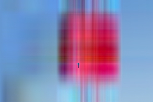

## How this App works

This App applies Singular Vector Decomposition on a JPEG image. It reduces the number of features to the input provided by the user through slider. Since the image can now be represented from less number of features its size is reduced. Features of all 3 colors i.e RED, GREEN and BLUE are reduced separately. The image is re-constructed to original dimensions but from a reduced set of features. The variance retained for each color is shown in the left sidebar panel. The variance tab shows plots that represent the portion of image data that is retained from the original image. This is plotted for each color. The user can upload any jpg image or select from dropdown list and then can download the reconstructed image.

---

## Eg:

Lets take only 9 features and try to reconstruct this image         from these.


Original Image

---

## Here's the R code that we will execute

```{r}
img <- readJPEG('./data/Flower.jpg')
  z.r <<- scale(img[,,1])
  z.g <<- scale(img[,,2])
  z.b <<- scale(img[,,3])
  svd1.r <<- svd(z.r)
  svd1.g <<- svd(z.g)
  svd1.b <<- svd(z.b)
  descale <- function(mat,att){
  t(t(mat)*att$'scaled:scale'+att$'scaled:center')
}
g<-9
      p.r <- descale(svd1.r$u[,1:g] %*% diag(svd1.r$d[1:g]) %*% t(svd1.r$v[,1:g]),attributes(z.r))
      p.g <- descale(svd1.g$u[,1:g] %*% diag(svd1.g$d[1:g]) %*% t(svd1.g$v[,1:g]),attributes(z.g))
      p.b <- descale(svd1.b$u[,1:g] %*% diag(svd1.b$d[1:g]) %*% t(svd1.b$v[,1:g]),attributes(z.b))
      
      myp <- array(c(p.r,p.g,p.b),dim=dim(img))
      writeJPEG(myp,'data/temp.jpg',1)
```


---&radio
## Think before proceeding...

Will the image quality degrade?

1. _Yes_

2. No

3. Can't say

*** .hint 
Try the app yourself [here](https://web3.shinyapps.io/app1/)

*** .explanation
Yes

---

```{r, echo=FALSE}
g<-2
      p.r <- descale(svd1.r$u[,1:g] %*% diag(svd1.r$d[1:g]) %*% t(svd1.r$v[,1:g]),attributes(z.r))
      p.g <- descale(svd1.g$u[,1:g] %*% diag(svd1.g$d[1:g]) %*% t(svd1.g$v[,1:g]),attributes(z.g))
      p.b <- descale(svd1.b$u[,1:g] %*% diag(svd1.b$d[1:g]) %*% t(svd1.b$v[,1:g]),attributes(z.b))
      
      myp <- array(c(p.r,p.g,p.b),dim=dim(img))
      writeJPEG(myp,'data/temp2.jpg',1)
```


## Image after Reconstruction


---


## Reconstructing the same image from 2 features



[Try the App now](https://web3.shinyapps.io/app1/)

[Source Code](https://github.com/hammad7/dataprod)
